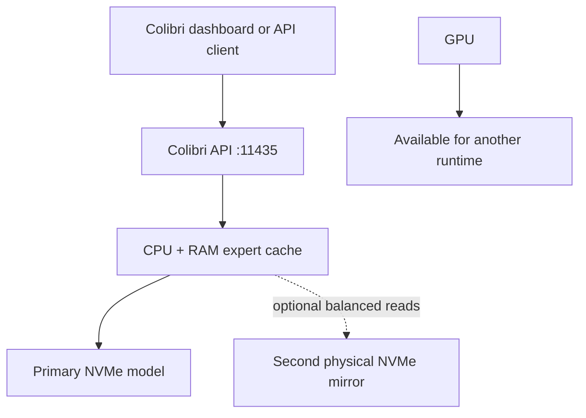

# Colibri Setup

Run [Colibri](https://github.com/JustVugg/colibri) as a persistent,
CPU/NVMe-backed OpenAI-compatible service while leaving the GPU completely
available for another inference runtime.

This toolkit turns Colibri into an operator-friendly service:

- builds a CPU-native Colibri binary, rejects CUDA/ROCm linkage, and removes
  inherited GPU backend selectors from the managed runtime;
- pins the default installation to upstream **Colibri v1.1.1**;
- uses the ready-to-run
  [`mastouri/GLM-5.2-colibri-int4-g64-with-int8-mtp`](https://huggingface.co/mastouri/GLM-5.2-colibri-int4-g64-with-int8-mtp)
  `gs64` model by default—no conversion step is required;
- downloads hundreds of gigabytes resumably in a detached GNU Screen session;
- calculates conservative through experimental resource profiles from the
  current host, enforces an 80% RAM ceiling, and refreshes stopped-service
  profiles before startup instead of embedding one machine's specifications;
- can spread expert reads over two **physical** NVMe drives using a validated
  model mirror;
- offers Open WebUI-only, Colibri dashboard, and API-only modes;
- manages lifecycle, diagnostics, logs, credentials, upgrades, and the full
  upstream `coli` CLI through one entry point;
- verifies that start/restart survives early engine initialization and limits
  deterministic systemd restart storms;
- always preserves model weights during stop and uninstall operations.

The default listener is `127.0.0.1:11435`, avoiding Colibri's common example
port while remaining private by default. Any unprivileged port from 1024 to
65535 can be selected during installation or changed later.

## Architecture

The intended deployment keeps inference quality intact while using CPU, RAM,
and fast storage for Colibri:



The primary model directory is authoritative and writable. The optional
second-NVMe copy is a byte-identical read mirror, not a split model, RAID
array, or backup. Colibri falls back to the primary copy when a mirrored file
is missing or invalid.

## Requirements

- Ubuntu or Debian with `systemd` and `apt-get`;
- a non-root deployment account with `sudo`;
- approximately 380 GB of free space for the recommended model, plus working
  space and a safety reserve;
- at least approximately 16 GiB RAM; 24 GiB or more and fast NVMe storage are
  strongly recommended by upstream;
- Internet access to GitHub, the operating-system package repositories, and
  Hugging Face;
- a second physical NVMe with enough capacity only if the mirror feature will
  be used.

The installer supplies the required compiler, Git, Python virtual
environment, Hugging Face CLI, GNU Screen, `rsync`, and supporting packages.
Node.js 22 and npm are installed for the default Colibri dashboard.

Run the toolkit as the account that should own Colibri. Do not run
`colibri.sh` as root; it uses `sudo` only for packages, protected
configuration, and the system service.

## Quick start

Clone this repository and inspect the deployment plan:

```bash
git clone https://github.com/vast-development-method/colibri-setup.git
cd colibri-setup
./colibri.sh --help
```

Install the default performance deployment with Colibri's own dashboard on
port `11435`:

```bash
./colibri.sh install
```

The installer shows every resolved path and resource value before asking for
confirmation. It clones and builds the pinned upstream release, creates the
service, generates an API key, and—if the model is absent—offers to start the
approximately 372 GB download in GNU Screen. The service remains disabled
until a complete model is available.

A read-only Hugging Face token is required for every managed command that
contacts the Hugging Face Hub. Authenticated downloads receive better rate
limits, and gated models require account access. Create a
token in [Hugging Face settings](https://huggingface.co/settings/tokens).
Store it once in the toolkit's private user environment file:

```bash
./colibri.sh hf-token set
./colibri.sh hf-token status
```

This writes exactly one `HF_TOKEN=...` assignment to
`~/.config/colibri-setup/.env` with mode `0600`. The file is parsed as data,
not sourced as shell code. Before any remote `hf` CLI operation, the toolkit
loads the value and exports `HF_TOKEN` to that subprocess, including detached
GNU Screen downloads. If it is absent, an interactive command asks once and
saves it; non-interactive commands stop with a setup instruction.

Then start the managed download:

```bash
./colibri.sh model download
```

Anonymous managed Hub access is intentionally disabled. Do not put a token in
this repository, a command-line argument, or a world-readable shell profile.

Monitor or attach to the detached download:

```bash
./colibri.sh model status
./colibri.sh model attach
```

Detach without stopping the download with `Ctrl-A`, then `D`. Interrupted
downloads retry with backoff and can be resumed without starting from zero.

When the download has completed:

```bash
./colibri.sh model verify
./colibri.sh doctor
./colibri.sh plan
./colibri.sh start
./colibri.sh logs --follow
```

`model verify` uses Hugging Face's checksum verifier against the configured
model repository. It reports files that are missing or checksum-broken and
does not modify the model. `.coli_usage` is ignored because it is Colibri
runtime state rather than an immutable model weight. While the complete model
is read, an elapsed-time heartbeat is printed every 10 seconds.

If verification identifies missing or checksum-broken model files, repair
exactly those files:

```bash
./colibri.sh model repair
```

The repair command prints the complete repair list and asks for confirmation.
It downloads only those paths into an isolated staging directory, without
`--force-download`. After the staged download succeeds, it replaces only the
listed broken files, verifies the complete model, and restores the originals
automatically if that verification fails. Hugging Face may display many Xet
transfer chunks while downloading one large shard; those chunks are not
additional model files.

In another terminal, verify discovery and run a tiny completion:

```bash
./colibri.sh test
./colibri.sh test --chat
```

The first start may be quiet for several minutes while the model loads.
`/health` becomes ready only after loading is complete.

## Choose one browser interface

All modes use the same model process and the same configurable port.

| Mode | Selection | Colibri dashboard | Intended client |
| --- | --- | --- | --- |
| Colibri web (default) | `./colibri.sh install` | Enabled | Colibri dashboard and API |
| Open WebUI edge case | `./colibri.sh open-webui setup` | Disabled | Existing Open WebUI |
| API-only edge case | `./colibri.sh ui set api-only` | Disabled | API clients or a reverse proxy |

In `open-webui` and `api-only` modes, the toolkit runs `coli serve` and removes
generated dashboard assets from the runtime checkout. This matters because
upstream can otherwise serve those assets even in API mode. Switching back to
`colibri-web` rebuilds them and runs `coli web --no-browser`.

Inspect the active choice at any time:

```bash
./colibri.sh ui show
```

### Open WebUI

Colibri exposes an OpenAI-compatible Chat Completions API, so Open WebUI does
not need a protocol adapter.

If Open WebUI runs in Docker:

```bash
./colibri.sh open-webui setup
./colibri.sh open-webui check
./colibri.sh open-webui values
```

The setup locates the Open WebUI container, detects its numeric Docker gateway,
binds Colibri only to that reachable host address, disables Colibri's own
dashboard, and checks `/health` and `/v1/models` from inside the container.
Select a particular container when more than one candidate exists:

```bash
./colibri.sh open-webui setup --container open-webui
./colibri.sh open-webui check --container open-webui
```

If Open WebUI runs directly on the host rather than in a bridged container:

```bash
./colibri.sh open-webui setup --local
```

In Open WebUI, open **Admin Panel → Settings → Connections → OpenAI → Add**
and use:

| Setting | Value |
| --- | --- |
| API type | Chat Completions / OpenAI-compatible |
| Base URL | Output of `./colibri.sh open-webui values` |
| API key | Output of `./colibri.sh api-key show` |
| Model ID | Output of `./colibri.sh open-webui values` |

The base URL ends in `/v1`. Colibri implements `GET /v1/models`, allowing Open
WebUI to discover the model. If necessary, add the reported model ID to Open
WebUI's model-filter allowlist.

CPU/NVMe requests can take longer than Open WebUI's normal client timeout.
The integration check warns about a short timeout but does not modify or
recreate an existing Open WebUI deployment. See
[Open WebUI integration](docs/OPEN-WEBUI.md) for the recommended timeout,
networking, model-filter, and background-task configuration.

Colibri provides text chat completions, streaming, multi-turn/system prompts,
supported reasoning fields, current function tools, and supported JSON
response formats. It is not an embeddings, image, or audio endpoint. Keep
Open WebUI background tasks and embeddings on an appropriate smaller local
model so they do not queue behind the large Colibri model.

### Direct API clients

The configured provider URL is:

```text
http://CONFIGURED_HOST:CONFIGURED_PORT/v1
```

Retrieve exact local values without exposing the secret in normal status
output:

```bash
./colibri.sh status
./colibri.sh open-webui values
./colibri.sh api-key show
```

Use standard bearer authentication with `COLI_API_KEY`. Prefer client secret
storage or a protected environment file; do not paste the key into source
code, tickets, logs, screenshots, or shell history. The wrapper's
`./colibri.sh test --chat` command is the safest first API validation.

## Resource profiles

Profiles are calculated from detected logical CPUs, installed memory, and
currently available memory. The RAM figure is Colibri's engine budget: upstream
uses it to bound resident tensors, expert cache, working memory, KV memory, and
runtime reserve. It is not merely an expert-cache setting. No managed profile
may exceed 80% of installed or currently available RAM when it is resolved.
Named profiles are resolved again before starting a stopped service so stale
installation-time availability cannot silently overcommit the host.

| Profile | Use case | Resource behavior |
| --- | --- | --- |
| `conservative` | Shared host under load | 50% RAM target with larger reserve, 4K context, fewer workers, direct I/O off |
| `balanced` | Lower-pressure fallback | 70% RAM target with healthy reserve, 8K context, direct I/O on |
| `performance` | Default deployment | 80% RAM target, more workers and pinned hot storage |
| `experimental` | Measured io_uring/pilot testing | Performance budget plus experimental I/O and pilot features |
| `custom` | Explicit operator budget | Requires RAM, context, and worker values |

Inspect and change profiles:

```bash
./colibri.sh profile list
./colibri.sh profile show balanced
./colibri.sh profile set conservative
./colibri.sh profile set performance
./colibri.sh profile set custom --ram 32 --ctx 8192 --workers 8
```

An active service is restarted after a profile change unless
`--no-restart` is supplied. Every profile keeps the engine CPU-only and the
GPU reserved. The service explicitly removes inherited CUDA, ROCm device, and
Metal selectors before launching the CPU binary:

```text
CPU-only Colibri build
GPU backend variables absent
```

The installer starts with `performance`. Move down to `balanced` or
`conservative` if monitoring shows unacceptable memory pressure, swap, or NVMe
service time. See [Tuning](docs/TUNING.md) for a controlled benchmarking cycle
and the quality-preserving defaults.

## Dual-NVMe model mirror

First place the recommended model on the faster or primary NVMe. To create a
second copy on another physical NVMe:

```bash
./colibri.sh model mirror /absolute/path/on/second-nvme/colibri-model
./colibri.sh model mirror-status
./colibri.sh model mirror-attach
```

When the detached copy is complete, validate and enable it:

```bash
./colibri.sh model enable-mirror /absolute/path/on/second-nvme/colibri-model
./colibri.sh restart
./colibri.sh logs --follow
```

Disable mirror routing without deleting the copy:

```bash
./colibri.sh model disable-mirror
```

Do not mirror to a different partition on the same physical NVMe. That does
not add storage bandwidth. The toolkit verifies names and sizes, offers a full
SHA-256 verification, keeps learned/KV sidecars on the primary, and preserves
both copies during uninstall. Colibri additionally validates safetensors
headers when accepting mirror shards at startup; upstream supports partial
mirrors even though this toolkit's managed copy produces a complete mirror.

## Daily operations

```bash
# State and health
./colibri.sh status
./colibri.sh test
./colibri.sh doctor
./colibri.sh plan

# Lifecycle
./colibri.sh start
./colibri.sh stop
./colibri.sh restart
./colibri.sh enable
./colibri.sh disable

# Logs
./colibri.sh logs
./colibri.sh logs --follow
./colibri.sh logs --since today

# Change listener, port, UI, model, or profile
./colibri.sh configure
./colibri.sh configure --port 21435 --profile balanced

# Credentials
./colibri.sh hf-token status
./colibri.sh hf-token set
./colibri.sh hf-token remove
./colibri.sh api-key show
./colibri.sh api-key rotate

# Explicit upstream update; normal install does not silently update
./colibri.sh upgrade
./colibri.sh upgrade --latest
```

Reinstall and upgrade build in a sibling staging directory, switch the source
atomically, and retain the previous checkout for rollback. A failed staged
build leaves the running checkout and service untouched.

The toolkit forwards the upstream Colibri command surface, including commands
added upstream after this wrapper was published:

```bash
./colibri.sh cli --help
./colibri.sh cli info
./colibri.sh cli doctor --json
./colibri.sh cli plan --json
./colibri.sh cli bench --help
./colibri.sh cli run "Summarize the operational risks in three bullets."
./colibri.sh cli chat
```

`cli chat` attaches to the running API service. Commands that could load a
second model process warn and offer to stop the managed service first, avoiding
unplanned RAM and NVMe contention. Colibri's dashboard-only telemetry and
terminal administration commands do not become OpenAI API operations; they
remain available through `colibri.sh cli`.

## Stop and uninstall guarantees

| Operation | Service/unit | Configuration | Colibri source | Primary model | NVMe mirror | Learned/KV sidecars |
| --- | --- | --- | --- | --- | --- | --- |
| `stop` | Stops service | Preserved | Preserved | **Preserved** | **Preserved** | **Preserved** |
| `disable` | Stops and disables | Preserved | Preserved | **Preserved** | **Preserved** | **Preserved** |
| `uninstall` | Removed | Preserved | Preserved | **Preserved** | **Preserved** | **Preserved** |
| `uninstall --remove-source` | Removed | Preserved | Removed only if proven toolkit-created | **Preserved** | **Preserved** | **Preserved** |
| `uninstall --purge-config` | Removed | Removed | Preserved | **Preserved** | **Preserved** | **Preserved** |

Preview and confirm the non-destructive uninstall:

```bash
./colibri.sh uninstall
```

The command is idempotent. After a failed first installation it removes any
positively identified managed artifacts, or reports success when transactional
cleanup already left nothing installed.

Model deletion is deliberately not implemented. If model weights must ever be
removed, verify the exact paths and handle that as a separate manual storage
operation.

## Network and firewall security

The default loopback bind is correct for local clients. For Open WebUI in
Docker, use `open-webui setup` so the listener is bound to the selected
container network's gateway rather than every interface.

For remote use:

- choose an explicit private bind address with `./colibri.sh configure
  --host ADDRESS --port PORT`;
- allow only the required source address or subnet in the host firewall;
- keep the generated API key enabled;
- place the service behind a TLS reverse proxy and an authenticated network
  boundary;
- never expose Colibri's native HTTP listener directly to the public Internet;
- treat the optional Colibri dashboard as private because its static shell and
  telemetry profile path are not fully protected by the provider API key.

Open only the configured port—not a broad range. For example, with UFW and a
trusted private source subnet:

```bash
sudo ufw allow from 192.0.2.0/24 to any port 11435 proto tcp
sudo ufw status verbose
```

`192.0.2.0/24` is a documentation-only address. Replace it with the exact
trusted private client or subnet; do not copy it as a functional firewall
rule. See [Security policy](SECURITY.md) before exposing any listener beyond
the host.

## Documentation

- [Operations and command reference](docs/OPERATIONS.md)
- [Open WebUI integration](docs/OPEN-WEBUI.md)
- [Performance and resource tuning](docs/TUNING.md)
- [Security policy](SECURITY.md)
- [Upstream Colibri documentation](https://github.com/JustVugg/colibri)
- [Upstream API guide](https://github.com/JustVugg/colibri/blob/main/docs/api.md)
- [Upstream tuning guide](https://github.com/JustVugg/colibri/blob/main/docs/tuning.md)
- [Hugging Face authentication](https://huggingface.co/docs/huggingface_hub/en/quick-start#authentication)
- [Open WebUI OpenAI-compatible providers](https://docs.openwebui.com/getting-started/quick-start/connect-a-provider/starting-with-openai-compatible/)

## Upstream relationship

This repository is an independent deployment and operations toolkit for
[JustVugg/colibri](https://github.com/JustVugg/colibri). It is not the
Colibri engine, does not redistribute model weights, and is not affiliated
with or endorsed by the Colibri authors, Hugging Face, the model publisher,
or Open WebUI.

Review upstream release notes and model licensing before deployment. The
default pin is intentionally stable; upstream code changes only when
`./colibri.sh upgrade` is explicitly requested.
